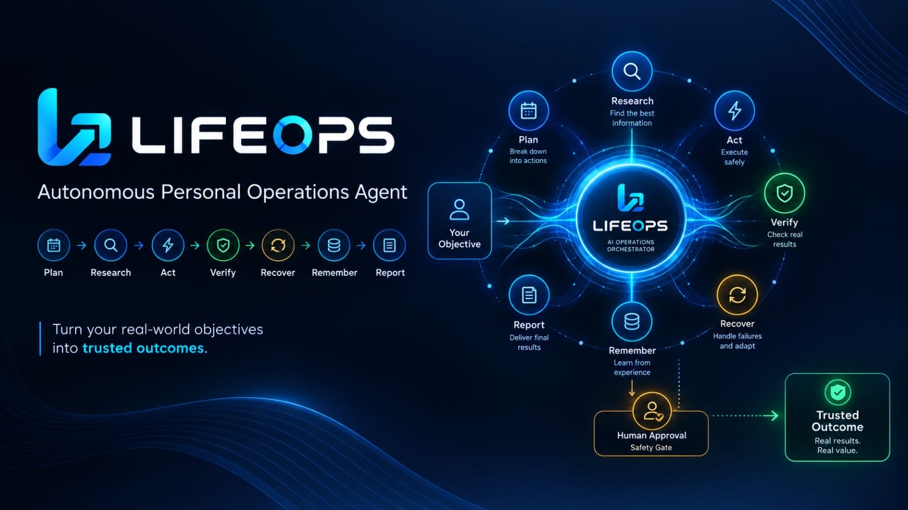
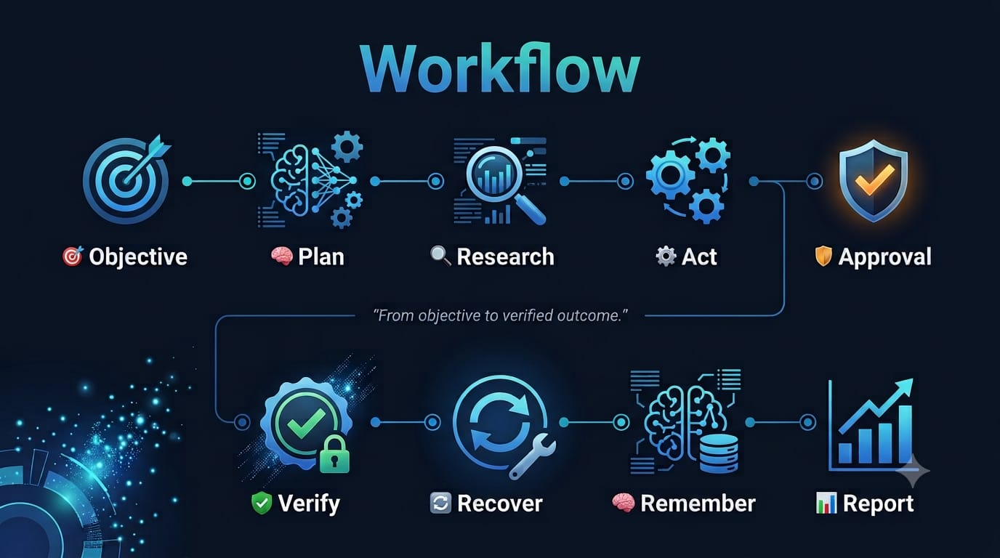
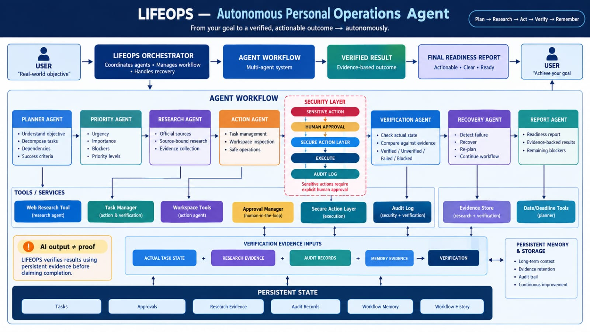
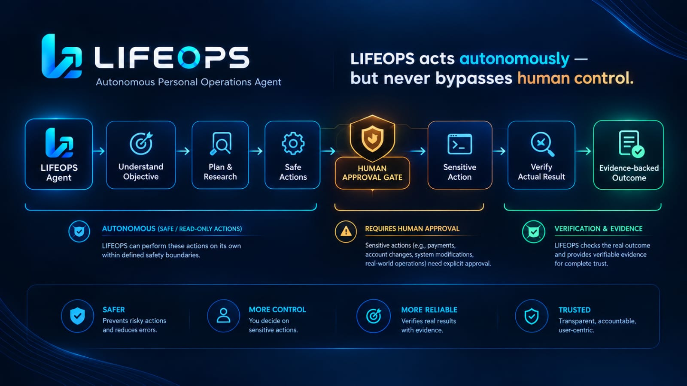
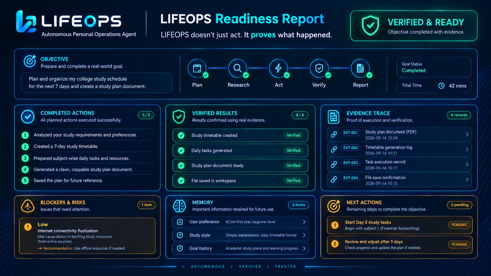

  

<h1 align="center">🚀 LIFEOPS</h1>

  <strong>Autonomous Personal Operations Agent</strong>

  <strong>Plan • Research • Act • Approve • Verify • Recover • Remember • Report</strong>

  
  
  
  
  

---

🌟 Mission

LIFEOPS is an autonomous personal operations agent designed to transform a real-world objective into a structured, evidence-backed and safely executed workflow.

🧠 Core Lifecycle

🎯 <strong>Objective</strong>
 → 
🧠 <strong>Plan</strong>
 → 
🔎 <strong>Research</strong>
 → 
⚙️ <strong>Act</strong>
 → 
🛡️ <strong>Approve</strong>
 → 
✅ <strong>Verify</strong>
 → 
🔄 <strong>Recover</strong>
 → 
🧠 <strong>Remember</strong>
 → 
📊 <strong>Report</strong>

---

🚀 What LIFEOPS Does

🧩 Capability| 💡 Description
🧠 Planning| Converts real-world objectives into structured tasks
🔎 Research| Researches information and preserves supporting evidence
⚙️ Action| Executes controlled and policy-aware actions
🛡️ Approval| Requires human approval for sensitive operations
🔐 Safety| Blocks unauthorized or unsafe sensitive actions
✅ Verification| Validates results using persistent evidence
🔄 Recovery| Handles workflow failures and recovery paths
🧠 Memory| Preserves useful workflow history and evidence
📊 Reporting| Produces a structured final readiness report

---

🖥️ Streamlit Dashboard

  

LIFEOPS includes a visual Streamlit dashboard for running and monitoring the complete agent workflow.

▶️ Run Locally

.\.venv\Scripts\python.exe -m streamlit run .\ui\dashboard.py

«ℹ️ The dashboard runs locally on the machine where LIFEOPS is installed.
No public dashboard URL is currently included in this repository.»

---

🏗️ Architecture

  

  <strong>
    Planner → Research → Action → Approval → Verification → Recovery → Memory → Report
  </strong>

📘 Architecture Documentation:
"docs/ARCHITECTURE.md" (docs/ARCHITECTURE.md)

---

🔄 LIFEOPS Workflow

  

Complete Workflow

🎯 Objective
↓
🧠 Plan
↓
📌 Prioritize
↓
🔎 Research
↓
⚙️ Act
↓
🛡️ Approval
↓
✅ Verify
↓
🔄 Recover
↓
🧠 Remember
↓
📊 Report

---

🛡️ Safety & Human Approval

  

LIFEOPS is designed around safe autonomy, ensuring that autonomous execution does not bypass human control or verification.

🔐 Safety Principles

- ✅ Explicit approval for sensitive operations
- 🚫 Unauthorized actions are blocked
- 🔁 Approval replay is prevented
- 📝 Sensitive operations are audited
- 📁 Controlled file operations
- 🚫 No unrestricted shell execution
- 👤 Human oversight for high-impact actions

«LIFEOPS does not treat autonomy as permission to perform everything. Safety and human control remain part of the workflow.»

---

🔍 Evidence-Based Verification

LIFEOPS separates action from verification.

An agent claiming that an operation was completed is not considered sufficient proof.

Verification can use:

- 📌 Task state
- 📝 Audit records
- 🔎 Research evidence
- 🧠 Memory evidence
- ⚙️ Action results
- 💾 Persistent workflow state

Verification States

🟢 <strong>VERIFIED</strong>
  •  
🟡 <strong>UNVERIFIED</strong>
  •  
🔴 <strong>FAILED</strong>
  •  
⛔ <strong>BLOCKED</strong>

---

📊 Readiness Report

  

After the workflow completes, LIFEOPS generates a structured Readiness Report containing status, evidence, verification results, issues and next steps.

📋 Report Section| 🔎 Purpose
🎯 Objective| Original real-world goal
📊 Status| Current workflow state
📚 Evidence| Supporting evidence collected
✅ Verification| Verification results
⚠️ Issues| Problems or unresolved items
🔄 Recovery| Recovery actions taken
🧠 Memory| Relevant workflow memory
🚀 Next Steps| Recommended actions

---

🧰 Technology Stack

  
  
  
  
  

🔧 Core Technologies

Python • Strands Agents SDK • Amazon Bedrock • Qwen • Streamlit • Git/GitHub • Evidence Store • Approval Manager • Audit Logging • Workflow Memory

---

📦 Installation

1️⃣ Clone the Repository

git clone https://github.com/snehassneha4578-collab/LIFEOPS.git

2️⃣ Enter the Project

cd LIFEOPS

3️⃣ Create Virtual Environment

python -m venv .venv

4️⃣ Activate Virtual Environment

Windows PowerShell:

.\.venv\Scripts\Activate.ps1

Windows Command Prompt:

.venv\Scripts\activate

5️⃣ Install Dependencies

pip install -r requirements.txt

6️⃣ Start LIFEOPS Dashboard

.\.venv\Scripts\python.exe -m streamlit run .\ui\dashboard.py

---

🧪 Testing

LIFEOPS includes regression coverage for important safety, verification and memory components.

Test Coverage

- 🛡️ Approval execution
- 🔁 Approval replay protection
- 🚫 Blocking sensitive actions without approval
- 🧠 Memory evidence integrity
- 📊 Report memory traceability
- 💾 Task persistence
- ✅ Verification memory traceability
- 🔎 Workflow memory retrieval

---

🎥 Demo Video

«🚧 Demo Video: Coming Soon»

The final demonstration will showcase the complete LIFEOPS workflow:

🎯 Objective
→ 🧠 Planning
→ 🔎 Research
→ ⚙️ Controlled Execution
→ 🛡️ Human Approval
→ ✅ Verification
→ 🔄 Recovery
→ 🧠 Memory
→ 📊 Final Readiness Report

---

🏆 Hackathon

  <strong>🤖 Agents for Humans Hackathon</strong>

  <strong>Track: Everyday Agents</strong>

  

---

💻 Repository

  

  <strong>GitHub:</strong>
  <a href="https://github.com/snehassneha4578-collab/LIFEOPS">
    snehassneha4578-collab/LIFEOPS
  </a>

---

👩‍💻 Developer

<strong>Sneha S</strong>

 ECE Student • AI/ML • Embedded Systems • VLSI

---

📜 License

This project is licensed under the MIT License.

---

<h2 align="center">🚀 LIFEOPS</h2>

  <strong>Autonomous operations with safety, evidence and verification.</strong>

  🎯 Plan &nbsp;•&nbsp;
  🔎 Research &nbsp;•&nbsp;
  ⚙️ Act &nbsp;•&nbsp;
  🛡️ Approve &nbsp;•&nbsp;
  ✅ Verify &nbsp;•&nbsp;
  🔄 Recover &nbsp;•&nbsp;
  🧠 Remember &nbsp;•&nbsp;
  📊 Report

